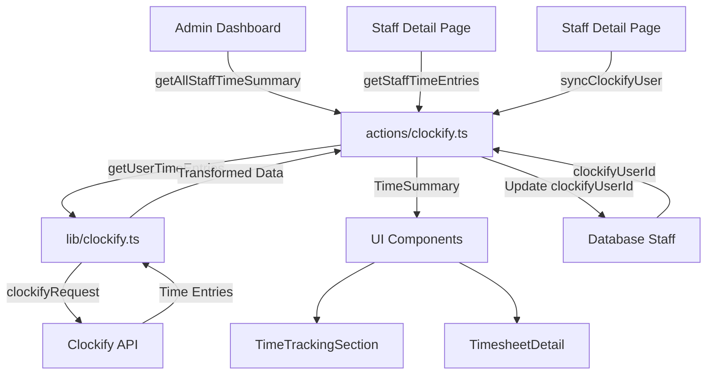

# Clockify Integration Health Check & Documentation

## Current Architecture

### Data Flow



### Key Components

1. **API Client** (`lib/clockify.ts`)

   - Base URL: `https://api.clockify.me/api/v1`
   - Authentication: `X-Api-Key` header
   - Main functions:
     - `getClockifyUsers()` - Fetch all workspace users
     - `getUserTimeEntries()` - Get time entries for a user
     - `calculateTimeSummary()` - Calculate daily breakdowns
     - `parseDurationToMs()` - Convert ISO 8601 duration to milliseconds

2. **Server Actions** (`actions/clockify.ts`)

   - `getStaffTimeEntries()` - Get entries for a specific staff member
   - `getAllStaffTimeSummary()` - Get summaries for all staff
   - `syncClockifyUser()` - Link Clockify user ID to staff record

3. **UI Components**

   - `TimeTrackingSection` - Dashboard widget showing all staff hours
   - `TimesheetDetail` - Detailed view with daily breakdown
   - Staff detail page - Link Clockify user ID

### Database Schema

```prisma
model Staff {
  clockifyUserId String?  // Links to Clockify user ID
  // ... other fields
}
```

## How It Works

### 1. Linking Staff to Clockify

- Admin navigates to staff detail page (`/admin/staff/[id]`)
- Enters Clockify User ID manually
- Calls `syncClockifyUser()` which updates `Staff.clockifyUserId` in database
- No validation that the user ID exists in Clockify workspace

### 2. Fetching Time Entries

- **For single staff**: `getStaffTimeEntries(staffId, startDate, endDate)`
  - Queries database for staff record
  - Validates `clockifyUserId` exists
  - Calls Clockify API: `/workspaces/{workspaceId}/user/{clockifyUserId}/time-entries`
  - Transforms Clockify format to internal `TimeEntry` format
  - Calculates daily breakdown using `calculateTimeSummary()`

- **For all staff**: `getAllStaffTimeSummary(startDate, endDate)`
  - Fetches all active staff with `clockifyUserId` set
  - Uses `Promise.all()` to fetch entries in parallel
  - Returns array of summaries with error handling per staff member

### 3. Data Transformation

Clockify API returns:

```typescript
{
  id: string,
  timeInterval: {
    start: "2024-01-01T10:00:00Z",
    end: "2024-01-01T12:00:00Z",
    duration: "PT2H30M15S"  // ISO 8601 duration
  },
  description: string,
  billable: boolean,
  projectId?: string,
  tags?: Array<{id: string, name: string}>
}
```

Transformed to:

```typescript

  id: string,
  start: Date,
  end: Date,
  duration: number,  // milliseconds
  description: string,
  billable: boolean,
  projectName?: string,
  tags?: string[]
}
```

### 4. Running Timers

- If `timeInterval.end` is null, entry is considered "running"
- Duration calculated from start time to current time
- Handled in `getUserTimeEntries()` lines 177-189

### 5. Error Handling

- **API Errors**: Handled in `clockifyRequest()` with specific messages for:
  - 401: Authentication failed
  - 404: Resource not found
  - 429: Rate limit exceeded
  - Other: Generic error with status code

- **Missing Data**: 
  - Staff without `clockifyUserId` returns error message
  - Failed API calls return error in summary object
  - UI displays warnings for staff with errors

## Health Check Findings

### ✅ Working Correctly

1. **API Integration**

   - Proper authentication headers
   - Correct API endpoint structure
   - ISO 8601 date formatting
   - Duration parsing handles edge cases

2. **Error Handling**

   - Rate limiting detection (429)
   - Authentication errors (401)
   - Resource not found (404)
   - Graceful degradation (errors don't crash the app)

3. **Data Processing**

   - Running timers handled correctly
   - Daily breakdown calculation works
   - Time aggregation accurate

4. **UI Integration**

   - Dashboard displays time summaries
   - Detailed timesheet view with expandable days
   - Bilingual support (Arabic/English)

### ⚠️ Issues Found

1. **CRITICAL: Empty Workspace ID**

   - `.env` file shows: `CLOCKIFY_WORKSPACE_ID=""`
   - This will cause all API calls to fail
   - **Impact**: Integration cannot function without this

2. **No Validation on Link**

   - `syncClockifyUser()` doesn't verify the user ID exists in Clockify
   - Admin can link invalid user IDs
   - **Impact**: Silent failures when fetching time entries later

3. **No Caching**

   - Every page load fetches fresh data from Clockify
   - Could hit rate limits with many staff members
   - **Impact**: Performance and potential API throttling

4. **No User Lookup Helper**

   - `findClockifyUserByEmail()` exists but not used in UI
   - Admin must manually find and enter Clockify user ID
   - **Impact**: Poor user experience, prone to errors

5. **Error Messages**

   - Generic error messages in some cases
   - No distinction between "user not found" vs "API error"
   - **Impact**: Difficult to debug issues

6. **Missing Features**

   - No bulk import of Clockify users
   - No automatic sync on staff creation
   - No validation that staff email matches Clockify email

## Recommendations

### Immediate Fixes

1. **Set Workspace ID**

   - Add `CLOCKIFY_WORKSPACE_ID` to `.env` with actual workspace ID
   - Verify API key is valid

2. **Add Validation**

   - Validate `clockifyUserId` exists before saving
   - Use `getClockifyUsers()` to verify user ID
   - Show error if user not found in workspace

3. **Improve User Experience**

   - Add dropdown/search to select Clockify user by email
   - Use `findClockifyUserByEmail()` to auto-populate user ID
   - Show staff email next to Clockify user selection

### Performance Improvements

1. **Add Caching**

   - Cache time entries for 5-15 minutes
   - Use Next.js cache or Redis
   - Invalidate on manual refresh

2. **Optimize Queries**

   - Batch API calls with smaller date ranges if needed
   - Add pagination for large result sets
   - Consider webhooks for real-time updates

### Enhanced Features

1. **Auto-linking**

   - Match staff email to Clockify email on staff creation
   - Auto-link if exact match found
   - Show confirmation dialog before auto-linking

2. **Better Error Messages**

   - Specific messages for each error type
   - Suggest solutions (e.g., "Check workspace ID in settings")
   - Log errors with context for debugging

3. **Monitoring**

   - Track API call success/failure rates
   - Alert on repeated failures
   - Dashboard showing integration health

## Files Involved

- **Core Integration**: `lib/clockify.ts` (272 lines)
- **Server Actions**: `actions/clockify.ts` (271 lines)
- **UI Components**: 
  - `components/admin/TimeTrackingSection.tsx` (184 lines)
  - `components/admin/TimesheetDetail.tsx` (255 lines)
  - `app/[locale]/admin/staff/[id]/StaffDetailClient.tsx` (Clockify linking UI)
- **Database**: `prisma/schema.prisma` (Staff model, line 217)
- **Configuration**: `.env` (CLOCKIFY_API_KEY, CLOCKIFY_WORKSPACE_ID)

## Testing Checklist

- [ ] Verify `CLOCKIFY_WORKSPACE_ID` is set and valid
- [ ] Test linking Clockify user ID to staff member
- [ ] Test fetching time entries for single staff
- [ ] Test fetching summaries for all staff
- [ ] Test with running timer (no end time)
- [ ] Test error handling (invalid user ID, API errors)
- [ ] Test date range filtering
- [ ] Test daily breakdown calculation
- [ ] Test UI display in both Arabic and English

## Conclusion

The Clockify integrat